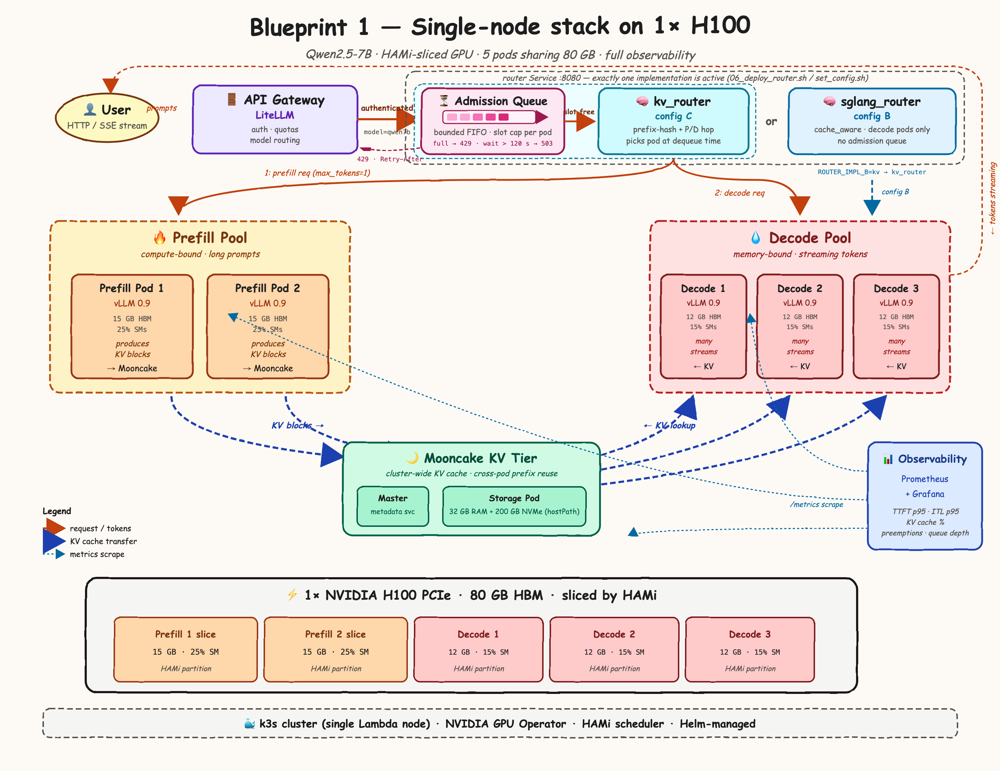

# Distributed LLM inference: Blueprint 1 on a single H100

A complete LLM inference stack on one HAMi-sliced NVIDIA H100: LiteLLM gateway, a cache-aware router with an admission queue, disaggregated prefill/decode vLLM pods, an LMCache/Mooncake KV tier, and Prometheus/Grafana. It includes benchmarks and a tool-calling agent workload that exercise the stack.

## What's here

| Path | Contents |
|---|---|
| [`Blueprint_1_single_node_H100.md`](Blueprint_1_single_node_H100.md) | The design plan for the single-node stack (phases 0–9) |
| [`blueprint1/`](blueprint1/README.md) | The runnable implementation: scripts per phase, Kubernetes manifests, `kv_router`, benchmarks, `config.env` |
| [`analyst_crew/`](analyst_crew/README.md) | CrewAI data-analyst crew (3 agents, 9 tools) that drives the cluster with graded, tool-heavy agent traffic |
| [`bench-results/`](bench-results/) | Measured results: quick benchmarks (`quick/`) and agent evaluations (`agent/`, including `agent_runs.csv` and `agent_questions.csv`) |
| [`Blueprint_2_multi_GPU_A100.md`](Blueprint_2_multi_GPU_A100.md) | The follow-up plan for an 8×A100 node |
| [`artifacts/`](artifacts/README.md) | Everything to look at, rendered on GitHub: the results report, architecture diagrams, Grafana screenshots, charts, PDFs |

## Getting started

1. Read [`blueprint1/README.md`](blueprint1/README.md), and run the offline tests: `blueprint1/tests/test_local.sh`.
2. Provision a Lambda 1× H100 node and run the phases in order (`blueprint1/scripts/00_…` to `08_…`).
3. Point the agent at the gateway: [`analyst_crew/README.md`](analyst_crew/README.md), "Run against the cluster, step by step".

## Results

**[Blueprint 1 results report](artifacts/docs/blueprint1-results-report.md)** ([PDF](artifacts/docs/blueprint1-results-report.pdf)): cluster setup, capacity on paper, `rate4`/`rateinf`/multi-turn benchmarks with and without the LMCache/Mooncake KV tier, and the agent validation runs.

Measured on 26 Sep 2026 in configuration C (2 prefill + 3 decode pods, `kv_router`, LMCache/Mooncake KV tier), compared with the same stack without the KV tier (`C-nokv`). Under a 400-request burst the KV tier raised throughput 9% and cut p95 inter-token latency from 197 to 40 ms; at light load it added 14–58% to time to first token. The agent validation runs were measured without the KV tier.
