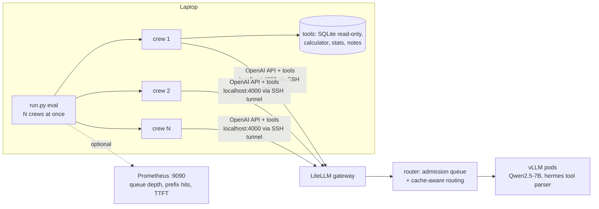

# Analyst crew: an agent workload for the Blueprint 1 cluster

A small [CrewAI](https://docs.crewai.com) system that answers business questions about a synthetic e-commerce database by making many tool calls. It runs on your laptop and sends its LLM calls to the Blueprint 1 inference cluster through the LiteLLM gateway.

It serves two purposes:

1. **A realistic agent demo.** Three agents explore a database, write and fix SQL, and cross-check each other. The prompts push them to explore and verify instead of guessing. A run can make up to about 45 tool calls (`AGENT_MAX_ITER` × 3 agents), with one LLM call per step.
2. **An agent-shaped benchmark for the cluster.** Each agent step re-sends a long, growing prompt that starts the same way every time. That's what prefix caching, `kv_router`'s prefix routing and the Mooncake KV tier are built to speed up. Running many questions at once also exercises the router's admission queue. Every answer is graded against ground truth, so you can see whether a change affects accuracy as well as speed.



The full hand-drawn schematic, in the same style as the blueprint diagrams: [`analyst_crew_architecture_excalidraw.svg`](../analyst_crew_architecture_excalidraw.svg).

## The crew

| Agent | Tools | Job |
|---|---|---|
| **Data Planner** | `list_tables`, `describe_table`, `sample_rows`, `distinct_values`, `save_note` | Explore the schema, read the data dictionary and `_metrics` definitions, and check real filter values. Outputs a query plan |
| **SQL Analyst** | `describe_table`, `run_sql`, `column_stats`, `calculator`, `save_note`, `read_notes` | Run the plan with small checking queries first. Fix SQL errors, which come back as text. Save the answer |
| **Reviewer** | `run_sql`, `column_stats`, `calculator`, `read_notes` | Verify the answer at least two independent ways. End with `FINAL_ANSWER: <value>` |

The tools are all local and use only the standard library. `run_sql` accepts a single `SELECT`/`WITH` statement on a read-only connection. The calculator is an AST evaluator, not `eval`. Results are cut off at 40 rows / 2,000 characters so the context doesn't blow up.

**The data** (`make_data.py`, seeded so it's the same every time): 500 customers, 60 products, ~3.7k orders, ~8k order lines and 1.5k support tickets. It has deliberate traps: only *completed* orders count as revenue, a per-order discount applies, cost lives on `products`, dates are text, and there's a medians question SQLite can't answer on its own. All of this is documented in `data_dictionary`, so agents that explore get it right.

**The questions** (`data/questions.json`): 12 questions, from easy (count customers in a region) to hard (region with the fastest quarter-over-quarter growth, median ticket resolution time, gross margin). Each has a ground-truth answer and a tolerance.

## Setup (about 2 minutes, laptop only)

Needs Python 3.10–3.13.

```bash
cd analyst_crew
uv venv --python 3.12 .venv && uv pip install --python .venv/bin/python -r requirements.txt
#   (or: python3.12 -m venv .venv && .venv/bin/pip install -r requirements.txt)
.venv/bin/python make_data.py          # -> data/shop.db, data/questions.json
cp .env.example .env                   # then set LLM_API_KEY
./tests/test_local.sh                  # offline check with a scripted fake LLM (no model, no cluster)
```

## Cluster prerequisites

The cluster must return OpenAI-style `tool_calls` and have room for long agent prompts. Both settings are already in `blueprint1/config.env`:

- `VLLM_EXTRA_ARGS="--enable-auto-tool-choice --tool-call-parser hermes"`: Qwen2.5's tool-call format. Without it, vLLM ignores `tools`, and the model writes JSON as text that CrewAI never runs.
- `MAX_MODEL_LEN=16384` (it was 4096): system prompt, tool schemas and 15+ tool results don't fit in 4k tokens.

If the vLLM pods were deployed before these changes, redeploy them: `./scripts/05_deploy_vllm.sh` (or `./scripts/set_config.sh C`).

## Run against the cluster, step by step

Run these on the laptop, after Blueprint 1 Phase 7 (gateway) passes. `LAMBDA_IP` and `SSH_KEY` must be set, the same as for the other `laptop.sh` commands.

**1. Open the tunnel** in a separate terminal, and leave it running. From `blueprint1/`:

```bash
./scripts/laptop.sh tunnel       # gateway -> localhost:4000, Prometheus -> localhost:9090
```

**2. Give the crew the gateway key.** From `analyst_crew/`:

```bash
cp .env.example .env
KEY=$(ssh -i $SSH_KEY ubuntu@$LAMBDA_IP "grep LITELLM_MASTER_KEY ~/blueprint1/.secrets.env | cut -d'\"' -f2")
sed -i '' "s|^LLM_API_KEY=.*|LLM_API_KEY=$KEY|" .env     # macOS sed; on Linux: sed -i "s|...|...|" .env
grep LLM_ .env                   # model hosted_vllm/qwen7b, URL http://localhost:4000/v1, your key
```

**3. Check that tool calling works through the gateway.** This takes about 10 seconds:

```bash
curl -s localhost:4000/v1/chat/completions -H "Authorization: Bearer $KEY" -H 'Content-Type: application/json' -d '{
  "model":"qwen7b","messages":[{"role":"user","content":"What is the weather in Paris?"}],
  "tools":[{"type":"function","function":{"name":"get_weather","parameters":{"type":"object","properties":{"city":{"type":"string"}},"required":["city"]}}}]
}' | python3 -m json.tool | grep -A6 tool_calls
```

You should see a `get_weather` call with `"city": "Paris"`. If `tool_calls` is `null`, fix that first (see Troubleshooting). Otherwise the crew runs zero tools.

**4. Run one question with the full trace:**

```bash
.venv/bin/python run.py ask --qid q01 -v
```

At the end, `tool calls:` should be well above 0. `correct:` shows whether the answer matched.

**5. Run the evaluation, with cluster metrics:**

```bash
.venv/bin/python run.py eval --qids q01,q02 --prometheus http://localhost:9090     # quick first measure
.venv/bin/python run.py eval --concurrency 4 --prometheus http://localhost:9090 --label "C no-kv-tier"      # all 12 questions
.venv/bin/python run.py eval --repeat 2 --concurrency 12 --prometheus http://localhost:9090 --label "C no-kv-tier, c12"   # heavier: shows the admission queue
```

Other forms:

```bash
.venv/bin/python run.py ask --qid q06 -v                                          # any graded question
.venv/bin/python run.py ask "Which channel has the highest cancellation rate?"    # any free-form question
```

Two things to keep in mind:

- **Record which cluster config was active for each run** (`cat ~/blueprint1/.active_config` on the node), and whether the Mooncake tier was on (`ENABLE_KV_TIER_C`). Results from different configs are only comparable when you know which was which.
- **A 7B model won't get every hard question right.** Compare runs by the change in accuracy and latency, not the absolute accuracy. `-v` shows where an agent went wrong.

`eval` runs each question in its own subprocess and prints one line per finished run. It writes `../bench-results/agent/<timestamp>/`, the same results tree `blueprint1/scripts/laptop.sh fetch` fills with the cluster benchmarks (`quick/`, `full/`). Set `BENCH_RESULTS_DIR` to move the whole tree:

- `summary.md`: accuracy, **why each failed run failed**, sampling settings, tool and LLM calls, guardrail retries, tokens, wall-time p50/p95, and a per-run table. With `--prometheus`, it adds cluster metrics over the run window: peak router queue depth, rejections, average queue wait, vLLM prefix hit rate, average TTFT, peak vLLM waiting requests, preemptions.
- `meta.json`: the run's label, model, sampling settings, concurrency, elapsed time and cluster metrics.
- `results.jsonl`: one record per question run, including tool calls by name and guardrail rejections.
- `<qid>_r<n>.trace.jsonl`: one line per LLM call, with the agent, start time, latency, tokens, finish reason and what the model returned. Read it to see where an agent went wrong.
- `<qid>_r<n>.log`: the output of each run.

### Report CSVs

After every `eval`, two CSVs next to the run folders are **rebuilt from all runs**:

| File | One row per | Columns |
|---|---|---|
| `bench-results/agent/agent_runs.csv` | eval run | run id, label, model, sampling settings, concurrency; accuracy overall and per difficulty; failure counts by reason; tool/LLM calls (total and mean), guardrail retries, tokens; elapsed, wall p50/p95, runs per minute, prompt tokens/s; cluster metrics (`prom_*`) |
| `bench-results/agent/agent_questions.csv` | question run | the same settings, plus question id, difficulty, correct, failure reason, expected vs got, a count for each of the 9 tools, LLM calls, tokens, latency |

**Label every run** with what you changed, so the report can group runs: `--label "C no-kv-tier"`, `--label "B sglang"`, and so on. To drop a bad run, delete its folder and rebuild: `.venv/bin/python run.py aggregate`.

**Failure reasons** (the `failure` column), checked in this order:

| Reason | Meaning |
|---|---|
| `error` | the run crashed, or an LLM call failed |
| `text_tool_call` | the final text is a tool call written as text/JSON, not an answer |
| `no_final_answer` | no `FINAL_ANSWER` line |
| `no_sql` | answered without running a single query, so the numbers are made up |
| `wrong_value` | ran queries and answered, but the value is wrong: a genuine reasoning or SQL mistake |

## Using it as a cluster experiment

| Question | How |
|---|---|
| Does prefix-aware routing help agents? | `eval --repeat 3 --concurrency 8` on config B vs config C (`./scripts/set_config.sh B` / `C`). Compare wall p50/p95 and `vllm_prefix_hit_rate` |
| What does the admission queue do under agent bursts? | `--concurrency 24` or more. Watch `router_queue_depth_max` / `router_queue_wait_avg_s`. Then repeat with `ROUTER_MAX_INFLIGHT_PER_WORKER=0` (no queue) and compare p95 and `vllm_preemptions` |
| Does the KV tier (Mooncake) help? | Config C with `ENABLE_KV_TIER_C=true` vs `false` |
| Is it the model or the infrastructure? | Accuracy should stay flat across configs. If it drops, requests are failing (see `llm_failures` in `results.jsonl`) or getting cut off by `MAX_MODEL_LEN` |

## Configuration (`.env`)

| Variable | Default | Notes |
|---|---|---|
| `LLM_MODEL` | `hosted_vllm/qwen7b` | CrewAI provider/model. `hosted_vllm/` = generic OpenAI-compatible server. The gateway sees `model=qwen7b` |
| `LLM_BASE_URL` | `http://localhost:4000/v1` | Gateway through the tunnel. Any OpenAI-compatible URL with tool calling works |
| `LLM_API_KEY` | – | LiteLLM master key |
| `LLM_TEMPERATURE` / `LLM_TOP_P` / `LLM_TOP_K` / `LLM_REPETITION_PENALTY` | `0.3` / `0.8` / `20` / `1.05` | Qwen2.5-style sampling. Greedy (`0`) caused repetition loops and broken tool calls. `top_k` and `repetition_penalty` go to vLLM in the request body |
| `LLM_MAX_TOKENS` / `LLM_TIMEOUT` | `1024` / `300` | Per LLM call. The timeout covers time spent in the router queue |
| `AGENT_MAX_ITER` | `15` | Max tool-loop steps per agent. It caps tool calls at roughly 45 per run |
| `GUARDRAIL_RETRIES` | `2` | How many times the analysis or review task is redone after its output is rejected |

## Troubleshooting

| Symptom | Cause | Fix |
|---|---|---|
| `tool calls: 0` and the answer contains JSON like `{"name": "list_tables", ...}` | The server isn't returning native `tool_calls` | Add the `hermes` tool-parser flags (see above) and redeploy vLLM. For another model, use a server and model with function calling |
| HTTP 400 `maximum context length` | `MAX_MODEL_LEN` too small for the growing conversation | Raise `MAX_MODEL_LEN` or lower `AGENT_MAX_ITER` |
| HTTP 429 / 503 from the gateway | Router admission queue full / wait timed out | Lower `--concurrency` or raise `ROUTER_QUEUE_MAX` / `ROUTER_QUEUE_TIMEOUT` in `blueprint1/config.env` |
| HTTP 401 | Wrong `LLM_API_KEY` | Re-read `.secrets.env` on the node |
| Many `text_tool_call` failures | The model batched many tool calls into one reply, and one malformed or cut-off call made vLLM's parser return them all as text. Or it looped on greedy decoding | The crew stops each reply at `</tool_call>` (one call per reply), samples with `LLM_TEMPERATURE` > 0, and uses guardrails. In the trace, look for `finish_reason: length` and several `<tool_call>` blocks in one response |
| Answers like `NULL`, `0.0`, or a made-up name, and the trace shows `no such table/column` errors | The agents guessed the schema | The Planner guardrail requires looking at the schema, every agent has `describe_table`, SQL errors list the real tables, and the review guardrail rejects `NULL`/"hypothetical" answers |
| `no_sql` failures | The model answered from imagination | The guardrails should force queries. If they still happen, raise `GUARDRAIL_RETRIES` |
| Low accuracy with mostly `wrong_value` | A 7B model's limits: wrong filters, forgetting the discount | Expected to some degree. Compare runs by the change in accuracy, not the absolute number. The trace shows the SQL it ran |

## Files

```
analyst_crew/
├── make_data.py       # synthetic SQLite DB + 12 questions with ground truth
├── tools.py           # 9 tools, call counters, read-only SQL guard
├── crew.py            # planner -> analyst -> reviewer, sampling, guardrails
├── run.py             # ask / eval / aggregate, grading, traces, Prometheus report
├── report.py          # failure reasons + agent_runs.csv / agent_questions.csv
├── tests/             # fake_llm.py (scripted OpenAI server) + test_local.sh
├── requirements.txt   # crewai (pinned)
└── .env.example
```
