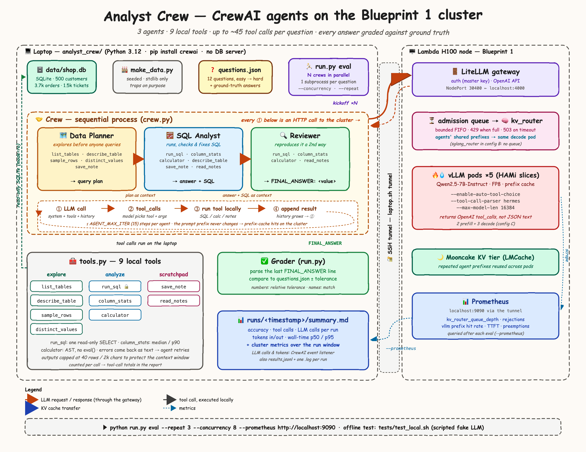
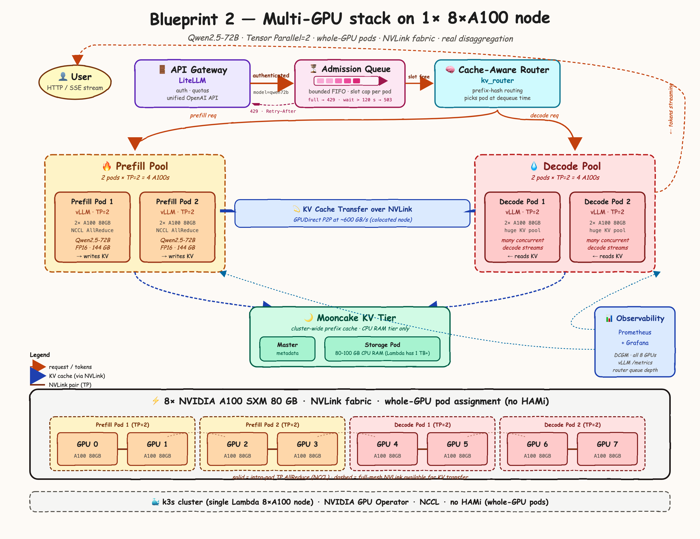
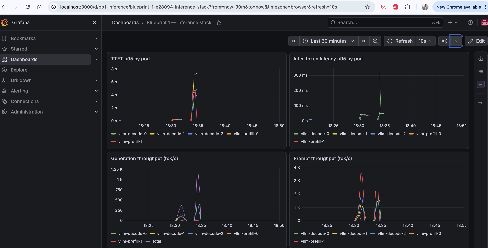
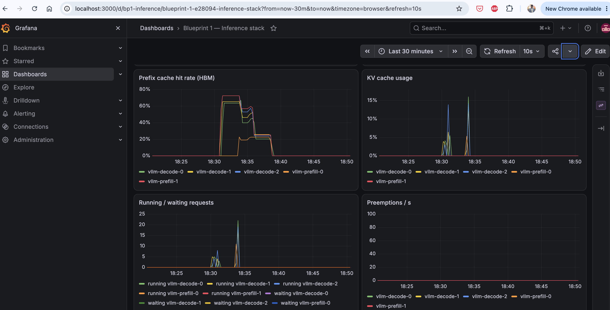
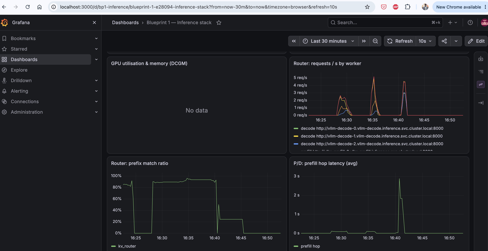
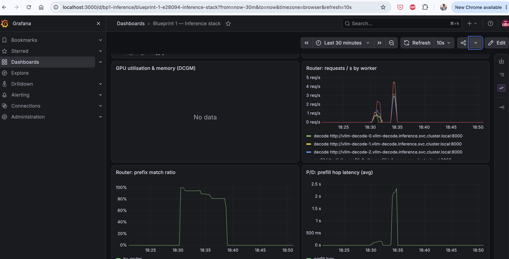
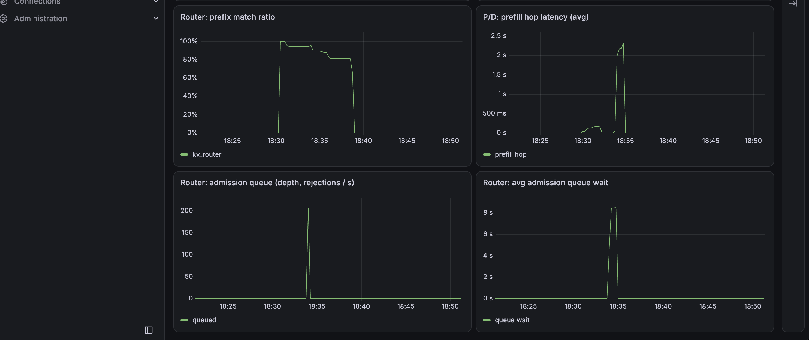
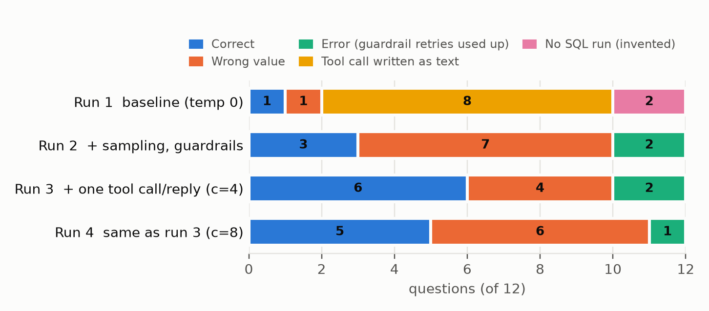
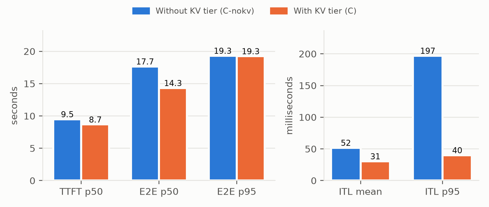
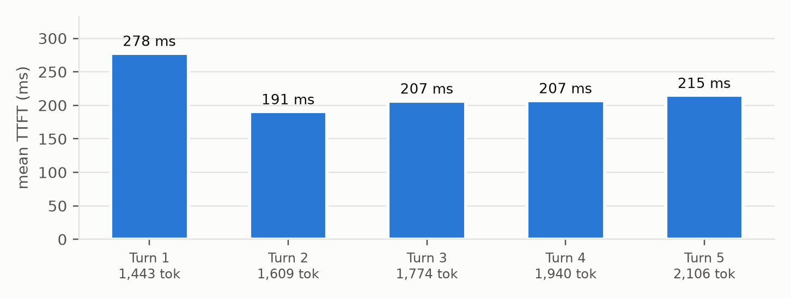

# Artifacts

Diagrams, screenshots, charts and documents for the project, in formats GitHub displays in the browser. Everything below renders inline; click any image for full size.

## Conventions (for new artifacts)

| Kind | Folder | Format | Naming |
|---|---|---|---|
| Architecture / flow diagrams | `diagrams/` | PNG to display, plus the SVG as the editable source | `<subject>-architecture.png` / `.svg` |
| Screenshots (Grafana, terminals, UIs) | `screenshots/<source>/` | PNG | `YYYY-MM-DD_<what-it-shows>.png` |
| Charts made from results | `charts/` | PNG | `<metric>-<breakdown>.png` |
| Documents and write-ups | `docs/` | PDF, plus page images in `docs/<topic>/` with a README for inline reading | `<topic>.pdf` |

- **Embed PNGs, not SVGs.** These hand-drawn SVGs don't display on GitHub, so each diagram has a PNG export. Render one with headless Chrome: `"/Applications/Google Chrome.app/Contents/MacOS/Google Chrome" --headless=new --force-device-scale-factor=2 --window-size=1400,1080 --screenshot="$PWD/x.png" "file://$PWD/x.svg"`.
- **PDF pages:** `pdftoppm -png -r 110 doc.pdf doc/page`, then list the pages in `doc/README.md`. HTML is not an option: GitHub shows HTML files as source code.
- **No Office files.** `.docx`, `.pptx` and `.xlsx` don't render on GitHub and are git-ignored. Export documents to PDF and screenshots to PNG. The original can stay on disk next to the export; git ignores it.
- **Use lowercase kebab-case names** without spaces, so links and URLs stay clean.
- **Add every new artifact to the gallery below**, with a one-line caption saying what it shows and which run it's from.
- **Raw results don't belong here.** CSV, JSON and logs go in [`../bench-results/`](../bench-results/); this folder is for things people look at.

## Diagrams

**Blueprint 1: single-node stack on 1× H100.** The router Service fronts `kv_router` (admission queue, prefix routing, prefill→decode hop; configuration C) or `sglang_router` (configuration B). The pod boxes show the original plan's slice sizes; as deployed, prefill slices are 16 GB and decode slices 14 GB.

**Agent system: the analyst crew.** The laptop-side CrewAI crew, its 9 local tools, the grader and the report, connected through the SSH tunnel to the gateway, router and vLLM pods.

**Blueprint 2: multi-GPU stack on 8× A100** (planned).

Editable sources: [`blueprint1-architecture.svg`](diagrams/blueprint1-architecture.svg), [`analyst-crew-architecture.svg`](diagrams/analyst-crew-architecture.svg), [`blueprint2-architecture.svg`](diagrams/blueprint2-architecture.svg).

## Grafana screenshots, 26 Sep 2026

Dashboard "Blueprint 1 — Inference stack", 30-minute windows. Without the KV tier (16:22–16:52): agent evaluation at concurrency 4 (≈ 16:28) and 8 (≈ 16:34), then the 400-request `rateinf` burst (≈ 16:40). With the KV tier (18:22–18:52): `rate4` (≈ 18:30), `multiturn` (≈ 18:31), `rateinf` (≈ 18:34).

### Latency and throughput

Without KV tier:

With KV tier:

### KV cache and scheduling

Without KV tier:

With KV tier:

### Router and GPU

Without KV tier:

With KV tier:

### Admission queue

Without KV tier:

With KV tier:

## Charts

**Agent evaluation outcomes by run** (12 questions each), from [`../bench-results/agent/agent_runs.csv`](../bench-results/agent/agent_runs.csv). The fixes between runs removed the mechanical failures; the remaining misses are mostly wrong values.

**400-request burst, without and with the KV tier**, from [`../bench-results/quick/`](../bench-results/quick/) (`results_C-nokv_rateinf.json`, `results_C_rateinf.json`). With the LMCache/Mooncake tier, throughput rose 9% and p95 inter-token latency fell from 197 to 40 ms.

**Multi-turn benchmark: time to first token by turn, without and with the KV tier**, from the `multiturn` results in [`../bench-results/quick/`](../bench-results/quick/). The GPU prefix cache already serves 85% of prompt tokens; the KV tier adds 29–55% to TTFT at this light load.

## Documents

- **Blueprint 1 results report**: cluster setup, capacity, benchmarks with and without the KV tier, agent validation. [Read on GitHub](docs/blueprint1-results-report.md) · [PDF](docs/blueprint1-results-report.pdf)
- **Blueprint 1: Kubernetes manifests explained** (15 pages): [read inline](docs/blueprint1-kubernetes-manifests-explained/README.md) · [PDF](docs/blueprint1-kubernetes-manifests-explained.pdf)
