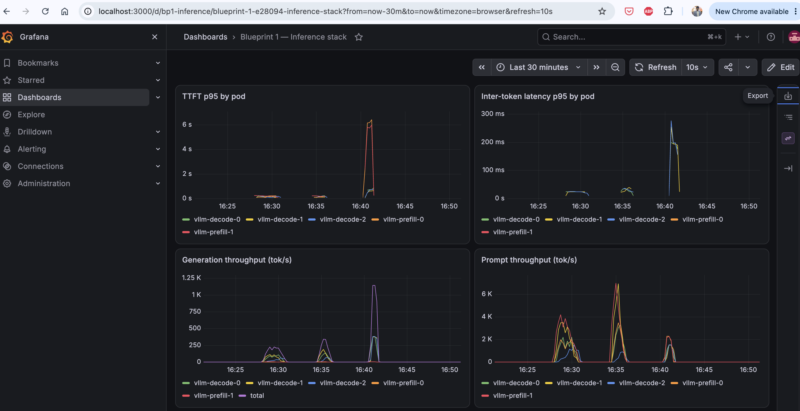
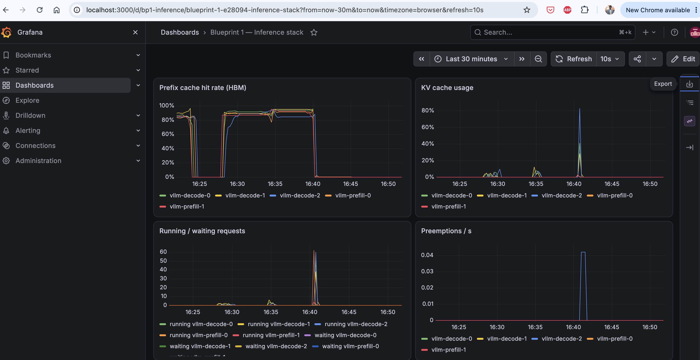
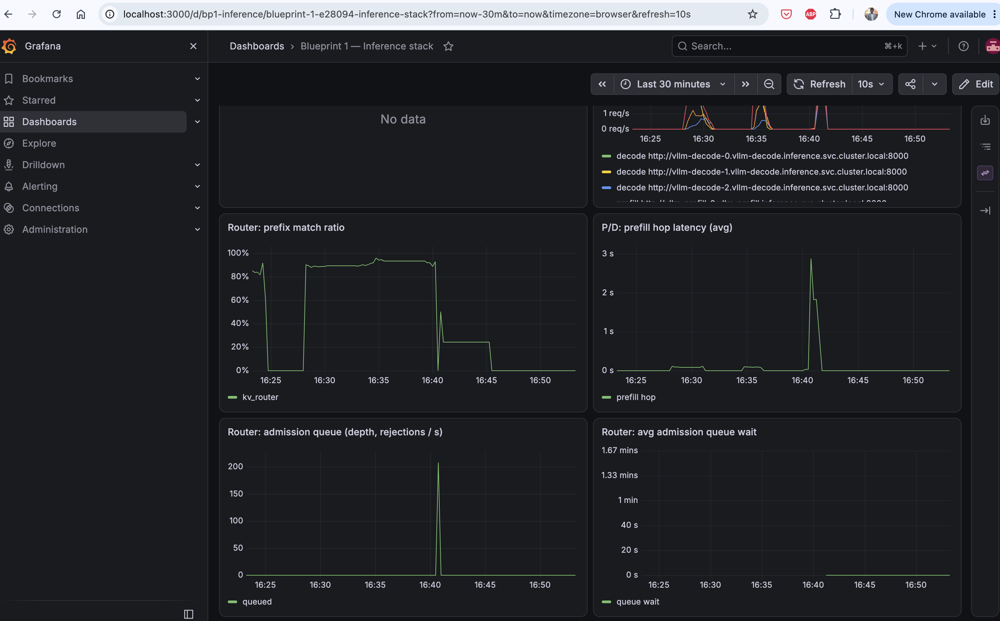

# Artifacts

Diagrams, screenshots, charts and documents for the project, in formats GitHub displays in the browser. Everything below renders inline; click any image for full size.

## Conventions (for new artifacts)

| Kind | Folder | Format | Naming |
|---|---|---|---|
| Architecture / flow diagrams | `diagrams/` | PNG to display, plus the SVG as the editable source | `<subject>-architecture.png` / `.svg` |
| Screenshots (Grafana, terminals, UIs) | `screenshots/<source>/` | PNG | `YYYY-MM-DD_<what-it-shows>.png` |
| Charts made from results | `charts/` | PNG | `<metric>-<breakdown>.png` |
| Documents and write-ups | `docs/` | PDF, plus page images in `docs/<topic>/` with a README for inline reading | `<topic>.pdf` |

- **Embed PNGs, not SVGs.** These hand-drawn SVGs don't display on GitHub, so each diagram has a PNG export. Render one with headless Chrome: `"/Applications/Google Chrome.app/Contents/MacOS/Google Chrome" --headless=new --force-device-scale-factor=2 --window-size=1400,1080 --screenshot="$PWD/x.png" "file://$PWD/x.svg"`.
- **PDF pages:** `pdftoppm -png -r 110 doc.pdf doc/page`, then list the pages in `doc/README.md`. HTML is not an option: GitHub shows HTML files as source code.
- **No Office files.** `.docx`, `.pptx` and `.xlsx` don't render on GitHub and are git-ignored. Export documents to PDF and screenshots to PNG. The original can stay on disk next to the export; git ignores it.
- **Use lowercase kebab-case names** without spaces, so links and URLs stay clean.
- **Add every new artifact to the gallery below**, with a one-line caption saying what it shows and which run it's from.
- **Raw results don't belong here.** CSV, JSON and logs go in [`../bench-results/`](../bench-results/); this folder is for things people look at.

## Diagrams

**Blueprint 1: single-node stack on 1× H100.** The router Service fronts `kv_router` (admission queue, prefix routing, prefill→decode hop; configuration C) or `sglang_router` (configuration B). The pod boxes show the original plan's slice sizes; as deployed, prefill slices are 16 GB and decode slices 14 GB.

**Agent system: the analyst crew.** The laptop-side CrewAI crew, its 9 local tools, the grader and the report, connected through the SSH tunnel to the gateway, router and vLLM pods.

**Blueprint 2: multi-GPU stack on 8× A100** (planned).

Editable sources: [`blueprint1-architecture.svg`](diagrams/blueprint1-architecture.svg), [`analyst-crew-architecture.svg`](diagrams/analyst-crew-architecture.svg), [`blueprint2-architecture.svg`](diagrams/blueprint2-architecture.svg).

## Grafana screenshots, 26 Sep 2026 (16:22–16:52)

Dashboard "Blueprint 1 — Inference stack", configuration C with the Mooncake KV tier off. Three bursts are visible: the agent evaluation at concurrency 4 (≈ 16:28–16:30), at concurrency 8 (≈ 16:34–16:35), and the 400-request `rateinf` burst (≈ 16:40–16:41).

**Latency and throughput per pod.** The burst drives TTFT p95 to ≈ 6 s and inter-token p95 to ≈ 280 ms; the agent runs stay sub-second.

**KV cache and scheduling.** Prefix-cache hit rate holds at 85–95% during the agent runs. At the burst, running requests reach ≈ 60 per pod while vLLM's waiting count stays near 0; KV usage and preemptions peak on `vllm-decode-2`, the pod with the smallest KV cache.

**Router and GPU.** Requests spread across the three decode pods; `kv_router`'s prefix-match ratio is ≈ 90% for agent traffic. The GPU panel is empty because DCGM metrics were not being collected.

**Admission queue.** Only the 400-request burst queues (peak ≈ 210); the agent runs never do. The queue-wait panel misses the burst because the router's wait counters appear only on first use.

## Charts

**Agent evaluation outcomes by run** (12 questions each), from [`../bench-results/agent/agent_runs.csv`](../bench-results/agent/agent_runs.csv). The fixes between runs removed the mechanical failures; the remaining misses are mostly wrong values.

**Multi-turn benchmark: time to first token by turn**, from [`../bench-results/quick/results_C_multiturn.json`](../bench-results/quick/results_C_multiturn.json). Later turns are faster despite longer prompts, because of prefix caching (85.6% hit rate).

## Documents

- **Blueprint 1: Kubernetes manifests explained** (15 pages): [read inline](docs/blueprint1-kubernetes-manifests-explained/README.md) · [PDF](docs/blueprint1-kubernetes-manifests-explained.pdf)
