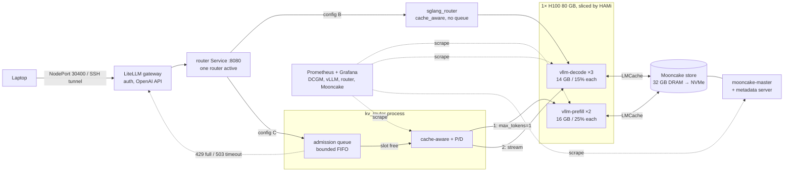

# Blueprint 1 — Single-node LLM inference stack on 1× H100

This is a runnable version of [`Blueprint_1_single_node_H100.md`](../Blueprint_1_single_node_H100.md). It puts every layer of a production inference stack on **one Lambda H100 node** and then runs an ablation benchmark that measures what each layer adds. The layers are: gateway → router (with an admission queue) → disaggregated prefill/decode vLLM pods → KV memory tiers (LMCache + Mooncake) → observability.



The same picture, drawn in full: [`blueprint_1_architecture_excalidraw.svg`](../blueprint_1_architecture_excalidraw.svg).

**The two routers are alternatives.** The `router` Service always points at exactly one of them. `set_config.sh` / `06_deploy_router.sh` pick which one:

| | `sglang_router` | `kv_router` (bundled, `router/kv_router.py`) |
|---|---|---|
| Used by | config B (default) | config C, and config B when `ROUTER_IMPL_B=kv` |
| Routing | cache-aware prefix hash | cache-aware prefix hash (same idea) |
| Prefill/decode hop | no (decode pods only) | yes (config C) |
| Admission queue | **no**. Requests go straight to a pod and wait in vLLM's own queue | **yes**. Max `ROUTER_MAX_INFLIGHT_PER_WORKER` per decode pod; the rest wait in the router and get a pod when one frees up |

---

## What changed from the blueprint, and why

Taken literally, the blueprint would fail or give misleading numbers in several places. Every fix below is already in the code:

| # | Blueprint says | Problem | What this repo does |
|---|---|---|---|
| 1 | 12–15 GB HBM slices for Qwen2.5-7B | The BF16 weights alone are ~15.2 GB, so every pod would OOM | Serves the model in **FP8** (native on H100, ~8.7 GB weights). Slices are 2×16 GB + 3×14 GB = 74 GB. Set `QUANTIZATION=""` in `config.env` for BF16 (then use fewer, larger slices) |
| 2 | Install the GPU Operator device plugin, then HAMi | Two device plugins advertise `nvidia.com/gpu` and conflict | The GPU Operator runs with `devicePlugin/driver/toolkit` disabled, so it only provides DCGM and feature discovery. HAMi is the only device plugin, and k3s runs with `--default-runtime=nvidia` (which HAMi requires) |
| 3 | `scheduler.kubeScheduler.imageTag=v1.29.0` | Must match the cluster version, and current k3s is newer | Detected from `kubectl version` |
| 4 | `mooncakelabs/mooncake:v0.3.5` image | This image doesn't exist. Mooncake ships as a pip wheel | One image (`image/Dockerfile`) = `lmcache/vllm-openai` + `mooncake-transfer-engine`. It's built on the node and imported into k3s |
| 5 | `MooncakeConnector` + a `mooncake.json` config | That connector and config format have changed between vLLM releases | Uses **LMCacheConnectorV1** with LMCache's Mooncake backend, which is the documented path. Tiers: HBM prefix cache → per-pod CPU RAM (LMCache) → Mooncake store (32 GB DRAM, spilling to NVMe) |
| 6 | SGLang router pointed at the `vllm-decode` ClusterIP Service | (a) kube-proxy load-balances under the router, so cache-aware routing can't see the pods. (b) **The prefill pods never receive a request**, so config C isn't actually disaggregated | vLLM runs as **StatefulSets** with headless Services, so each pod has its own DNS name. Config C uses the bundled **`router/kv_router.py`**, which sends a `max_tokens=1` copy of the request to a prefill pod (LMCache writes its KV to Mooncake), then streams the real request from a decode pod picked by prefix affinity (which reads that KV back) |
| 7 | LiteLLM `cache: true` | Repeated benchmark prompts would be answered from LiteLLM's response cache, which skews every number | Response cache is off. The master key is randomly generated, not `sk-lambda-demo` |
| 8 | `vllm bench serve --model qwen7b` | `qwen7b` isn't a Hugging Face repo, so the benchmark can't load a tokenizer | Adds `--tokenizer Qwen/Qwen2.5-7B-Instruct` and `--ignore-eos` (fixed output length) |
| 9 | "Multi-turn" run = ShareGPT | ShareGPT mode sends independent single-turn prompts, so there's no cross-turn KV reuse | `bench/multiturn_bench.py` runs real 50-session × 5-turn conversations with growing context. ShareGPT is still available (`RUN_SHAREGPT=true`) |
| 10 | Metrics dump once, from one decode pod | A cumulative counter from one pod mixes runs together | Snapshots **every** pod plus the Mooncake master before and after each run. `analyze.py` computes per-run deltas |
| 11 | No queue anywhere: the gateway and router forward every request immediately | A burst is split across pods on arrival and waits inside each vLLM pod's own queue, where it can't move to a pod that frees up first. Nothing ever returns 429, and the router can't see the backlog | `kv_router` has a bounded **admission queue**: each decode pod gets at most `ROUTER_MAX_INFLIGHT_PER_WORKER` requests (default `MAX_NUM_SEQS`), and the rest wait in the router. The pod is picked when a slot frees up. A full queue returns 429, and a long wait returns 503. Metrics: `kv_router_queue_depth`, `kv_router_rejected_total`, `kv_router_queue_wait_seconds_*` |

Versions were checked against PyPI and Docker Hub in Sep 2026: vLLM/LMCache image `lmcache/vllm-openai:v0.5.5` (CUDA 13, vLLM 0.29), `mooncake-transfer-engine-cuda13==0.3.13.post1`, `sglang-router==0.3.2`. They're all pinned in `config.env`.

---

## Repository layout

```
blueprint1/
├── config.env                  # ALL tunables: versions, slices, model, bench grid
├── scripts/
│   ├── lib.sh / stack.sh       # helpers; stack.sh knows how to build configs A/B/C
│   ├── 00_preflight.sh         # Phase 0  GPU/driver/disk checks
│   ├── 01_install_k3s_gpu.sh   # Phase 1  k3s + nvidia runtime + GPU Operator
│   ├── 02_install_hami.sh      # Phase 2  HAMi + 8 GB canary
│   ├── 03_install_observability.sh  # Phase 3  Prometheus/Grafana/DCGM + dashboard
│   ├── 04_deploy_mooncake.sh   # Phase 4  build image, Mooncake master + store
│   ├── 05_deploy_vllm.sh       # Phase 5  model download, prefill+decode pools
│   ├── 06_deploy_router.sh     # Phase 6  cache-aware / P/D router
│   ├── 07_deploy_gateway.sh    # Phase 7  LiteLLM
│   ├── 08_run_benchmarks.sh    # Phase 8  ablation grid → results + summary.md
│   ├── 09_teardown.sh          # Phase 9  pause / resume / delete
│   ├── run_all.sh              # phases 0-7 in one go
│   ├── set_config.sh           # switch the plane to config A, B or C
│   ├── status.sh               # one-screen health of every layer
│   └── laptop.sh               # (laptop) sync / ssh / tunnel / smoke / fetch
├── manifests/                  # k8s templates (rendered from config.env via envsubst)
├── image/Dockerfile            # vLLM + LMCache + Mooncake
├── files/                      # vLLM entrypoint, Mooncake store-node program
├── router/kv_router.py         # cache-aware + prefill/decode router (aiohttp only)
├── bench/                      # multiturn_bench.py, scrape_metrics.py, analyze.py
└── tests/                      # no-GPU local tests (fake vLLM servers)
```

---

## Prerequisites

- A Lambda Cloud account with your SSH key uploaded.
- A Hugging Face token. Qwen2.5-7B-Instruct is public, but a token avoids rate limits.
- On your laptop: `ssh`, `rsync`, `curl`. You don't need `kubectl` locally, because everything runs on the node.
- **Budget:** ~$2.50/hr. The full run (phases 0–8) takes ~6–8 h of node time, which is **~$15–25**. Terminate the instance whenever you stop working.

Optional, before spending money: check the router and benchmark code locally (needs `python3` + `aiohttp`):

```bash
cd blueprint1
./tests/test_local.sh        # → ALL LOCAL TESTS PASSED
```

---

## Step-by-step

### Phase 0 — Provision the node and connect (≈10 min)

1. In the Lambda console, launch **1× H100 PCIe** with the **newest Lambda Stack (Ubuntu 22.04/24.04)** image. The container image is built on CUDA 13, so the NVIDIA driver must be **≥ 580**, and preflight checks this. Note the public IP.
2. On your laptop:

   ```bash
   cd distributed_inferencing/blueprint1
   export LAMBDA_IP=<public-ip>
   export SSH_KEY=~/.ssh/lambda_key          # the key you uploaded to Lambda
   ./scripts/laptop.sh sync                  # copies this folder to /home/ubuntu/blueprint1
   ./scripts/laptop.sh ssh
   ```
3. On the node:

   ```bash
   cd ~/blueprint1
   export HF_TOKEN=hf_xxx                    # put this in ~/.bashrc so later shells have it too
   ./scripts/00_preflight.sh
   ```

**Pass gate:** `PASS GATE: nvidia-smi shows NVIDIA H100 ... (81559 MB), driver 5xx, no processes running`

> Shortcut: from here, `./scripts/run_all.sh` runs phases 0–7 in order and stops at the first failed gate. If it stops, fix the problem and resume from that phase with `./scripts/run_all.sh <phase>`. The phases below are the same steps, one at a time.

### Phase 1 — k3s + NVIDIA runtime + GPU Operator (≈15 min)

```bash
./scripts/01_install_k3s_gpu.sh
```

This installs the NVIDIA container toolkit if it's missing. It starts k3s (Traefik off, `--default-runtime=nvidia`), installs Helm, and installs the GPU Operator (DCGM and feature discovery only). Then it runs a CUDA pod.

**Pass gate:** the smoke pod prints `GPU 0: NVIDIA H100 ...`. The `nvidia.com/gpu` resource appears in phase 2, because HAMi is now the device plugin.

### Phase 2 — HAMi fractional GPU sharing (≈10 min)

```bash
./scripts/02_install_hami.sh
```

This labels the node `gpu=on`, installs HAMi with the matching kube-scheduler tag, and runs a canary pod that requests `gpumem: 8192, gpucores: 20`.

**Pass gate:** `canary sees 8192 MiB — HAMi is slicing the H100`. The GPU physically has 80 GB, so this proves the slicing works.

### Phase 3 — Observability (≈10 min)

```bash
./scripts/03_install_observability.sh
```

This installs kube-prometheus-stack and turns on the DCGM ServiceMonitor. It also adds PodMonitors for vLLM, the routers and the Mooncake master, and provisions the **"Blueprint 1 — Inference stack"** Grafana dashboard (TTFT/ITL p95, tok/s, prefix-hit rate, KV usage, preemptions, GPU utilization, router affinity, P/D hop latency, admission queue depth / rejections / wait).

To open Grafana, run this from a **second laptop terminal**:

```bash
export LAMBDA_IP=<ip> SSH_KEY=~/.ssh/lambda_key
./scripts/laptop.sh tunnel     # Grafana :3000 (admin/admin), Prometheus :9090, gateway :4000
```

**Pass gate:** the script finds `DCGM_FI_DEV_GPU_UTIL` in Prometheus, and Grafana shows GPU temperature and utilization.

### Phase 4 — Build the image + Mooncake KV tier (≈20 min, mostly image pull)

```bash
./scripts/04_deploy_mooncake.sh
```

This builds `bp1/vllm-lmcache-mooncake` and imports it into k3s containerd. Then it deploys:
- `mooncake-master`: RPC on :50051, the embedded HTTP metadata server on :8080, metrics on :9003, with offload-on-evict enabled.
- `mooncake-store`: joins the cluster, contributes 32 GB of DRAM, and spills to `/home/ubuntu/mooncake-storage` on NVMe.

Re-running is cheap: `SKIP_IMAGE_BUILD=true ./scripts/04_deploy_mooncake.sh`.

Before deploying Mooncake, the script runs a one-minute **GPU check** pod (`manifests/cluster/image-gpu-check.yaml`) on a 2 GB HAMi slice. It initializes CUDA and imports vLLM's kernels, LMCache and Mooncake, as a vLLM pod does at startup. A broken image fails here instead of 20 minutes into Phase 5. The build itself also fails if vLLM and PyTorch target different CUDA versions (`image/check_cuda.py`).

**Pass gate:** the GPU check prints `GPU CHECK OK`, both Mooncake pods are Running, and the store log shows `mooncake store node ready`.

### Phase 5 — vLLM prefill + decode pools (≈15–25 min)

```bash
./scripts/05_deploy_vllm.sh          # config C layout: 2 prefill + 3 decode, LMCache→Mooncake
```

A Job first downloads the model once into `/home/ubuntu/hf-cache`, so five pods don't race each other. Then it creates two StatefulSets (`vllm-prefill`, `vllm-decode`) on HAMi slices. The first boot compiles CUDA graphs and caches them in `/home/ubuntu/vllm-cache`, so later boots are faster.

Watch progress with `kubectl -n inference get pods -w` and `kubectl -n inference logs -f vllm-decode-0`.

**Pass gate:** every pod answers `"The capital of France is"` with *Paris*. The script also prints the LMCache/Mooncake init lines from `vllm-decode-0`.

### Phase 6 — Router (≈5 min)

```bash
./scripts/06_deploy_router.sh        # config C: kv_router with P/D orchestration
```

**Pass gate:** two requests that share a long prefix both succeed through `router.inference.svc:8080`. The `kv_router_prefix_matched_blocks_total` counter goes up, which shows the second request was routed to the same decode pod.

To see the admission queue, check the router's `/workers` endpoint. It shows `inflight` per pod and `queue_depth`, which should be 0 when the stack is idle:

```bash
kubectl -n inference exec deploy/bench-client -- curl -s http://router.inference.svc.cluster.local:8080/workers
```

During the `rateinf` benchmark, in-flight requests per decode pod stop at `ROUTER_MAX_INFLIGHT_PER_WORKER`, and the extra requests show up in `queue_depth` (and the Grafana "admission queue" panel) instead of in vLLM's `num_requests_waiting`.

### Phase 7 — LiteLLM gateway (≈5 min)

```bash
./scripts/07_deploy_gateway.sh
```

This generates a random gateway key in `.secrets.env` and prints it. It checks an authenticated chat completion, and checks that a wrong key is rejected.

From the laptop, with the tunnel from phase 3 open:

```bash
./scripts/laptop.sh smoke
# or manually:
curl http://localhost:4000/v1/chat/completions -H "Authorization: Bearer <key>" \
  -H 'Content-Type: application/json' \
  -d '{"model":"qwen7b","messages":[{"role":"user","content":"1+1="}],"max_tokens":5}'
```

To call `http://$LAMBDA_IP:30400` directly instead of through the tunnel, open TCP 30400 **to your own IP only** in the Lambda firewall settings.

**Pass gate:** a response from the full chain: laptop → LiteLLM (auth) → router (cache + P/D) → vLLM prefill → Mooncake → vLLM decode.

### Phase 8 — Benchmarks: quick pieces (≈5 min each) or the full grid (hours)

**Quick profile (start here).** It runs the same three kinds of traffic in miniature, against **the config that's already deployed**, so nothing is redeployed:

```bash
./scripts/08_run_benchmarks.sh quick          # active config (C after Phase 7): ~5 min
./scripts/08_run_benchmarks.sh quick B        # another piece: switches to B first (+ a few min of pod restarts)
./scripts/08_run_benchmarks.sh quick A        # ...and A
./scripts/set_config.sh C                     # back to the full stack for the agent runs
```

| Quick pattern | What | Why it's in |
|---|---|---|
| `rate4` | 100 random prompts (512 in / 128 out) at 4 req/s | Steady, paced load |
| `rateinf` | the same 100 prompts all at once | A burst. Exercises batching and, on `kv_router`, the admission queue |
| `multiturn` | 20 sessions × 5 turns, shared system prompt + document | The prefix-cache / Mooncake story: TTFT by turn |

Each piece prints how long every pattern took, then rebuilds `~/bench/results-quick/summary.md` with **all quick pieces so far**. After running `quick`, `quick B` and `quick A` you have a complete, smaller A/B/C comparison. Quick and full results live in separate directories and never mix. Existing results are skipped, so re-running a piece is cheap; use `FORCE=true` to redo one. Sizes can be changed with `QUICK_NUM_PROMPTS`, `QUICK_RATES`, `QUICK_MT_SESSIONS` and `QUICK_MT_TURNS`.

For agent-shaped load, the [`../analyst_crew`](../analyst_crew/README.md) eval (see "Optional — agent workload" below) complements these runs.

**Full grid (optional, hours).** Every config × `rate1`/`rate8`/`rateinf`/`multiturn`, with 200 prompts and 50 sessions:

```bash
tmux new -s bench                    # benchmarks run for hours: survive SSH drops
./scripts/08_run_benchmarks.sh
```

For each config the script redeploys the inference plane, warms it up, and runs four patterns:

| Config | Pods | Prefix cache | Router | KV tier |
|---|---|---|---|---|
| **A** baseline | 1 × `vllm-single` (14 GB/15%) | off | none (direct) | – |
| **B** routed | 3 × decode | on | `sglang_router --policy cache_aware` (no queue) | – |
| **C** full | 2 × prefill + 3 × decode | on | `kv_router` (admission queue + cache-aware + P/D) | LMCache → Mooncake (DRAM → NVMe) |

**Note:** by default only config C has the admission queue, so B → C also measures the queue's effect, most visibly at `rateinf`. To compare B and C with the same routing and queueing, set `ROUTER_IMPL_B=kv`. To remove the queue from C, set `ROUTER_MAX_INFLIGHT_PER_WORKER=0`.

| Pattern | What it is |
|---|---|
| `rate1`, `rate8`, `rateinf` | `vllm bench serve`, random 512-in/128-out, 200 prompts |
| `multiturn` | 50 sessions × 5 turns, shared ~800-token system prompt + ~1k-token document, context grows every turn |
| `sharegpt` (optional) | `RUN_SHAREGPT=true`; the blueprint's ShareGPT run |

Useful variants:

```bash
CONFIGS="C" PATTERNS="multiturn" ./scripts/08_run_benchmarks.sh   # a single cell
FORCE=true ./scripts/08_run_benchmarks.sh                         # rerun existing results
BENCH_VIA_GATEWAY=true CONFIGS="B C" ./scripts/08_run_benchmarks.sh  # include LiteLLM overhead
./scripts/set_config.sh B                                         # just switch configs manually
```

Outputs go to `/home/ubuntu/bench/results/`:
- `results_<cfg>_<pattern>.json`: 12 files
- `metrics_<cfg>_<pattern>_{before,after}.txt`: server-side snapshots of every pod
- `mooncake_master_C_*.log`, `log_*.txt`
- **`summary.md` / `summary.csv`**: the ablation table, with TTFT p50/p95, ITL p95, E2E p95, output tok/s, HBM prefix-hit %, LMCache connector-hit %, preemptions and Mooncake ops. It also has an A→B / B→C relative-change table and a TTFT-by-turn table for the multi-turn runs.

**How to read it** (per the blueprint):
- **A → B:** big throughput gain at `rate8` / `rateinf` (3 replicas, batching, prefix caching).
- **B → C:** small or even negative change on random prompts. Every request now makes an extra prefill hop, and all pods share one GPU's HBM bandwidth. The gain should show up on **multi-turn**: a higher hit rate and flatter TTFT across turns 2–5.
- If C doesn't beat B on multi-turn, check that Mooncake is actually being used: the Mooncake-ops/connector-hit columns should be non-zero, and `kubectl -n inference logs vllm-decode-0 | grep -i lmcache` should show retrievals. Also check the router is sticky: the `kv_router_prefix_matched_blocks_total` metric. **Timebox this to 60 minutes**, as the blueprint advises. The fallback is to set C = B and record "Mooncake integration left as future work".

### Optional — agent workload

[`../analyst_crew`](../analyst_crew/README.md) is a CrewAI crew that runs on your laptop and makes many tool calls through the gateway. It answers graded questions about a synthetic SQLite database. Use it to compare configs B and C, and the admission queue, under agent-shaped traffic: long, growing prompts that start the same way, arriving in bursts.

```bash
# laptop, with ./scripts/laptop.sh tunnel open
cd ../analyst_crew && .venv/bin/python run.py eval --repeat 3 --concurrency 8 --prometheus http://localhost:9090
```

### Phase 9 — Fetch results and tear down (≈5 min)

```bash
# laptop
./scripts/laptop.sh fetch            # → ../bench-results/quick/ and ../bench-results/full/ (each has summary.md)
```

Then **terminate** the instance in the Lambda console. Lambda also bills stopped instances.

If you're only pausing for a few hours, run `./scripts/09_teardown.sh pause` / `resume` on the node. The instance still bills while it runs. `09_teardown.sh workloads` removes the inference and KV namespaces but keeps the cluster. `09_teardown.sh nuke` uninstalls k3s.

---

## Configuration knobs (`config.env`)

| Variable | Default | Notes |
|---|---|---|
| `QUANTIZATION` | `fp8` | `""` = BF16; then raise slices to ≥20 GB and run fewer pods |
| `PREFILL_*` / `DECODE_*` / `SINGLE_*` | 16 GB/25%, 14 GB/15%, 14 GB/15% | Totals must stay ≤ 81920 MB and ≤ 100 cores |
| `GPU_MEM_UTIL` | `0.90` | Fraction of the **slice**. HAMi virtualizes the memory vLLM sees |
| `MAX_MODEL_LEN` | `16384` | Was 4096. Agents (`../analyst_crew`) need room for tool schemas and many tool results. Drop back to 4096 if a slice runs out of KV cache |
| `MAX_NUM_SEQS` | `64` | Lower = less CUDA-graph memory inside small slices |
| `VLLM_EXTRA_ARGS` | `--enable-auto-tool-choice --tool-call-parser hermes` | Lets Qwen2.5 return OpenAI `tool_calls` (needed by function-calling clients such as `../analyst_crew`). Add `--enforce-eager` if a slice is too tight for CUDA graphs |
| `MOONCAKE_STORE_GB` | `32` | Store pod DRAM (the pod requests this + 4 GB) |
| `LMCACHE_LOCAL_CPU_GB` | `4` | Per-pod CPU RAM tier |
| `ENABLE_KV_TIER_C` | `true` | `false` = config C without LMCache/Mooncake (debug fallback) |
| `ROUTER_IMPL_B` | `sglang` | Set to `kv` if sglang_router won't work with vLLM workers |
| `ROUTER_MAX_INFLIGHT_PER_WORKER` | `$MAX_NUM_SEQS` | kv_router sends each decode pod at most this many requests. The rest wait in the router's queue, and the pod is picked when a slot frees up. `0` = no cap and no queue (the old behavior) |
| `ROUTER_QUEUE_MAX` / `ROUTER_QUEUE_TIMEOUT` | `512` / `120` s | When the queue is full, the router returns 429. When a request waits too long, it returns 503. Keep `ROUTER_QUEUE_MAX` above `BENCH_NUM_PROMPTS`, or the `inf`-rate runs will get 429s. Watch `kv_router_queue_depth` and `kv_router_rejected_total` |
| `BENCH_*`, `MT_*` | see file | Grid size, lengths, multi-turn shape |
| `BASE_IMAGE`, `*_VERSION` | pinned | Change here to upgrade; rebuild with phase 4 |

After you edit `config.env` on your laptop, run `./scripts/laptop.sh sync`, then re-run the phase that uses the setting.

---

## Troubleshooting

| Symptom | Likely cause | Fix |
|---|---|---|
| HAMi canary shows ~80 GB | Pod wasn't scheduled by HAMi, or nvidia isn't the default runtime | Check `schedulerName: hami-scheduler` and `grep default_runtime /var/lib/rancher/k3s/agent/etc/containerd/config.toml` |
| `vllm-*` CrashLoop: CUDA OOM / "not enough KV cache" | Slice too small | Raise `*_GPUMEM`, lower `MAX_NUM_SEQS`, or set `VLLM_EXTRA_ARGS=--enforce-eager` |
| Phase 4 build: `error: externally-managed-environment` | A bare `pip` hit Ubuntu 24.04's system Python. The base image's venv (`/opt/venv`) was made with `uv` and has no pip | Already fixed in `image/Dockerfile`: it installs into `/opt/venv` with `uv pip install --python "$(command -v python3)"`. If you change `BASE_IMAGE`, keep installing into the interpreter that has vLLM |
| `ImportError: libcuda.so.1` (Phase 4 build, or Mooncake pods at start) | The Mooncake wheel links the NVIDIA driver library, which only exists at run time. `NVIDIA_VISIBLE_DEVICES=void` mounts no driver libraries at all | Already fixed: the build checks imports against the CUDA stub library, and the Mooncake master/store pods use `NVIDIA_VISIBLE_DEVICES=none` (driver libraries, no GPU) |
| vLLM: `CUDA driver version is insufficient` | Driver < 580 for the CUDA 13 image | Use a newer Lambda image, or pick a `BASE_IMAGE` tag built for your CUDA |
| vLLM pods crash at start: `ImportError: libcudart.so.13` | `BASE_IMAGE` mixes CUDA versions. The `v0.5.5-cu129` tag has a CUDA 13 vLLM on a CUDA 12.9 torch | Fixed: `BASE_IMAGE` is now the all-CUDA-13 `v0.5.5` tag. `image/check_cuda.py` fails the build on a mismatch, and Phase 4's GPU check imports vLLM on a real GPU slice |
| vLLM pods stuck `Pending` | HAMi slices over-committed (the old pool hasn't released yet) | `kubectl -n inference get pods`; wait for terminations. Check that slice totals are ≤ 80 GB |
| LMCache/Mooncake errors in vLLM logs | Master unreachable, or config keys changed in a newer LMCache | `kubectl -n kv-tier logs deploy/mooncake-master`. The generated config is printed at the top of each vLLM pod log. **Fallback:** `ENABLE_KV_TIER_C="false"` in `config.env` runs config C without the KV tier |
| `mooncake_master` exits on an unknown flag | Offload flags differ in your Mooncake version | Set `MOONCAKE_ENABLE_OFFLOAD="false"` |
| Mooncake store `setup failed` | Master not ready, or wrong metadata URL | Delete the store pod after the master is Ready; check `http://mooncake-master.kv-tier:8080/metadata` |
| `sgl-router` never Ready / 5xx | sglang_router health check or API mismatch with vLLM | `ROUTER_IMPL_B=kv` (same cache-aware policy, vLLM-native) |
| Grafana panels empty for vLLM | PodMonitor not picked up | `kubectl -n inference get podmonitor`. In Prometheus → Status → Targets, look for `podMonitor/inference/vllm` |
| `vllm bench` can't load tokenizer | HF rate limit / no token | Export `HF_TOKEN` before phase 5 (it's stored in the `hf-token` secret) |
| Router returns 429 `router queue full` | More requests waiting than `ROUTER_QUEUE_MAX` | Raise `ROUTER_QUEUE_MAX` (keep it above `BENCH_NUM_PROMPTS`) or send load more slowly. This is the queue doing its job under overload |
| Router returns 503 `timed out waiting in router queue` | Decode pods are too slow to drain the queue within `ROUTER_QUEUE_TIMEOUT` | Raise `ROUTER_QUEUE_TIMEOUT`, or check `/workers`: an unhealthy pod means fewer slots |
| Gateway 401 | Wrong key | `cat ~/blueprint1/.secrets.env` on the node |

`./scripts/status.sh` shows every namespace, the GPU memory in use, and the HAMi allocations on one screen.

---

## What this proves, and what it doesn't

**Proves:** all layers can run together and talk to each other on one GPU. HAMi lets 5 LLM pods share one H100. Cache-aware routing and a shared KV tier change multi-turn TTFT in a measurable way. The metrics path works end to end.

**Doesn't prove:** real disaggregation latency wins (every pod shares one GPU's HBM bandwidth and SMs), Mooncake's cross-node RDMA path (TCP on one host here), scaling past ~5 pods per GPU, or 70B-class throughput. Those need Blueprint 2.
